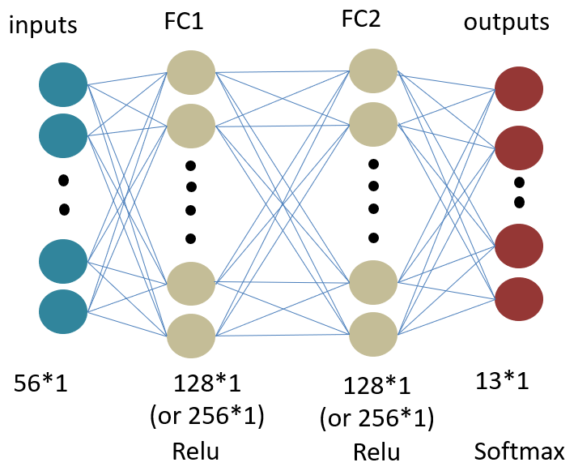
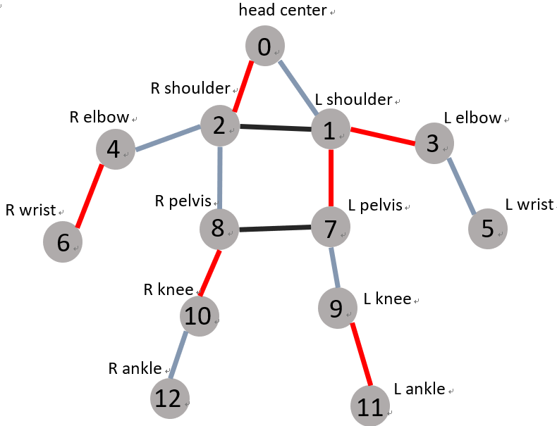
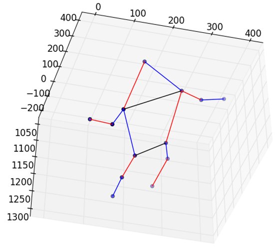
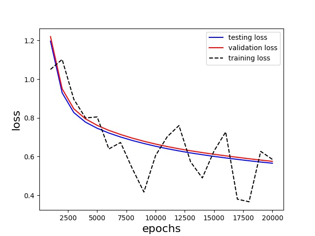
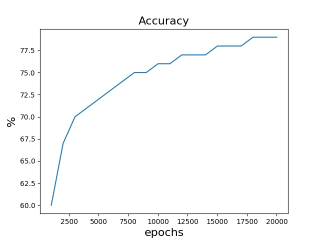

# PoseClassifer

## Intro
This repo is a simple neural network classifier that classified 13 human pose classes. 

Given 14 body joints as `node:[x1,y1,z1,v],left_eye:[x2,y2,z2,v],....,right_ankle:[x14,y14,z14,v]` similar to [COCO data format](https://www.immersivelimit.com/tutorials/create-coco-annotations-from-scratch/#coco-dataset-format), the model will output one a pose like `stand_up` or`sit-down` on each testing data.  
 
(v: visibility, if the joint is visible, v=1, otherwise, v=0 ) 
 
## Feature
1. Pytorch  
2. Python 3.6  

## Network Structure

## Sample result

## Training result

